# BandAid

**An offline music archive for audiophiles and discophiles.**

BandAid is a strictly local, decentralised musical databank. It pulls metadata from Discogs, stores everything in a SQLite database on your machine, and severs all ties with corporate surveillance clouds and algorithmic dictation. No telemetry. No social integration. Pure data preservation.

> *"Warning: This service may cause discomfort in users accustomed to being tracked."*

---

## Download

Grab the latest installer from the **[Releases](../../releases)** page.

Double-click `BandAid Setup.exe` — it installs and opens automatically. Nothing else to install.

> Windows will show a SmartScreen warning on first launch since the app isn't code-signed.
> Click **More info → Run anyway**. This is standard for unsigned open-source apps.

**Windows only for now.**

---

## First-Time Setup

The only prerequisite is a free Discogs API token. BandAid walks you through it on first launch, but here's the short version:

1. Create a free account at [discogs.com](https://www.discogs.com)
2. Go to [discogs.com/settings/developers](https://www.discogs.com/settings/developers)
3. Click **Generate new token** and copy it
4. In BandAid → **Settings → API Keys** → paste it in

Manual entry works without a token if you want to skip this entirely.

---

## Library

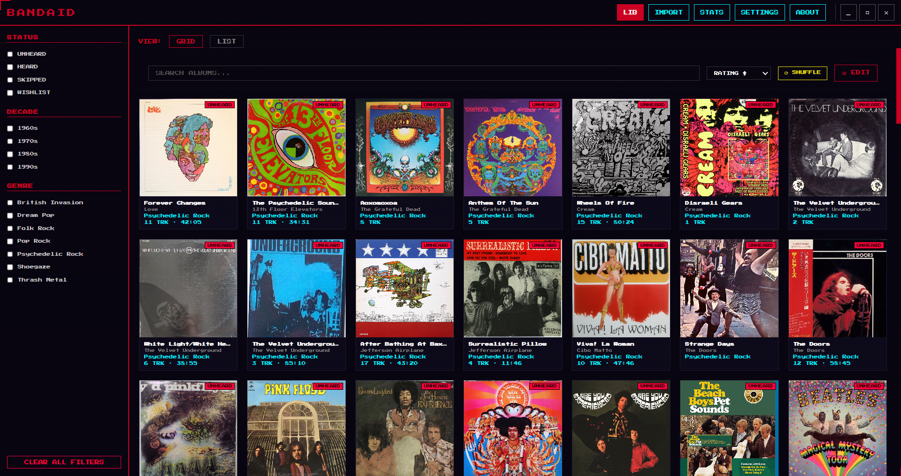

Your full collection in grid or list view. The left sidebar lets you filter by listen status (unheard, heard, skipped, wishlist), decade, and genre. Sort by title, artist, year, rating, or date added. Search hits title, artist, genre, and year simultaneously.

The shuffle button picks a random unheard album when you can't decide what to put on.

---

## Album Detail

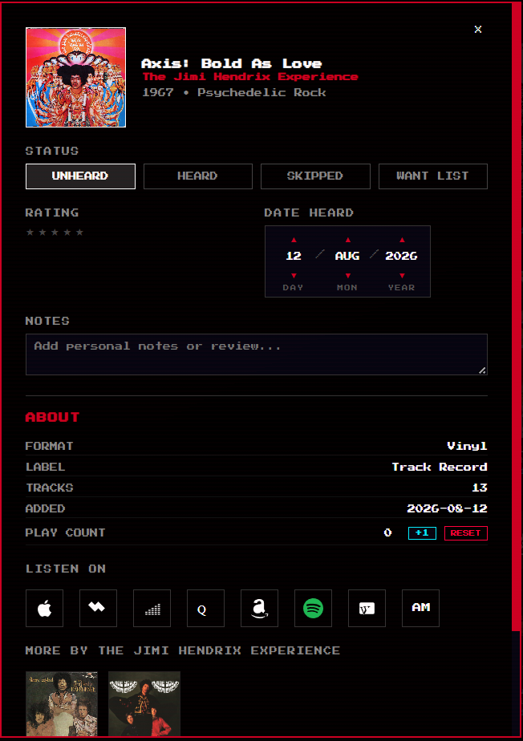

Click any album to open its full record — cover art, metadata, format, label, track count. From here you can:

- Set listen status: **Unheard / Heard / Skipped / Want List**
- Rate it 1–5 stars
- Log the date you heard it
- Write personal notes or a review
- Track play count manually with +1 / Reset
- Open it directly in Apple Music, Spotify, Deezer, Qobuz, Amazon Music, Tidal, or Last.fm via the **Listen On** row
- Browse other albums by the same artist at the bottom

Classical releases get extended fields: composer, conductor, and orchestra tracked separately.

---

## Import

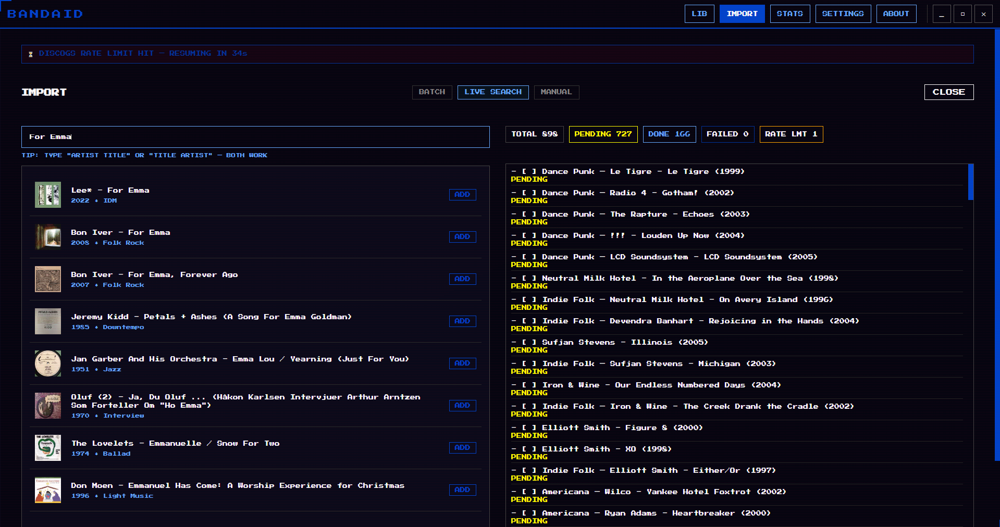

Three ways to build your library:

### Batch Import

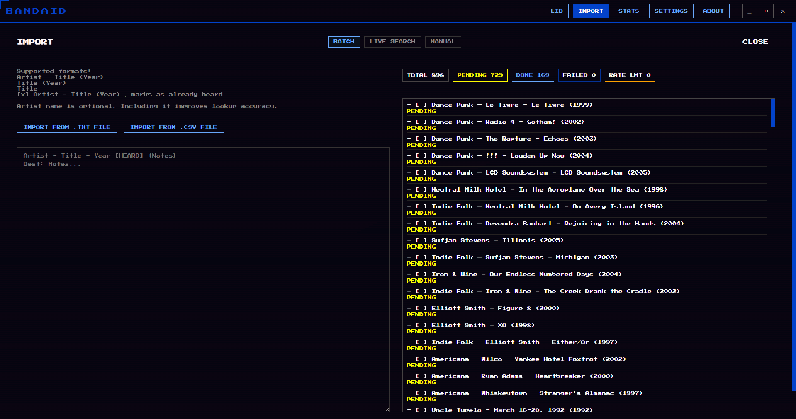

Paste a plain-text list and BandAid resolves everything against Discogs in the background. The queue shows live status per entry — pending, done, failed, rate limited. When Discogs rate limits kick in, a countdown shows exactly when it resumes.

Supported formats:

```
Artist – Title (Year)
Artist – Title
Title (Year)
[x] Artist – Title (Year)    ← pre-mark as heard
```

Genre headers work — any line without a dash gets treated as a category label:

```
Psychedelic Rock
The 13th Floor Elevators – The Psychedelic Sounds (1966)
Love – Forever Changes (1967)
The Grateful Dead – Anthem of the Sun (1968)

Jazz
Miles Davis – Kind of Blue (1959)
```

Inline annotations attach to the line above:

```
Boards of Canada – Geogaddi (2002)
Best: Music Is Math
Notes: listen alone at night
```

Drop a `.txt` file directly if you don't want to paste. RateYourMusic CSV exports are also supported — import the file and BandAid handles the column mapping automatically.

The importer deduplicates against your existing library using exact matching and fuzzy Levenshtein distance, so near-identical entries don't sneak through twice.

### Live Search

Type into the search bar, pick from real-time Discogs results, hit Add.

### Manual Entry

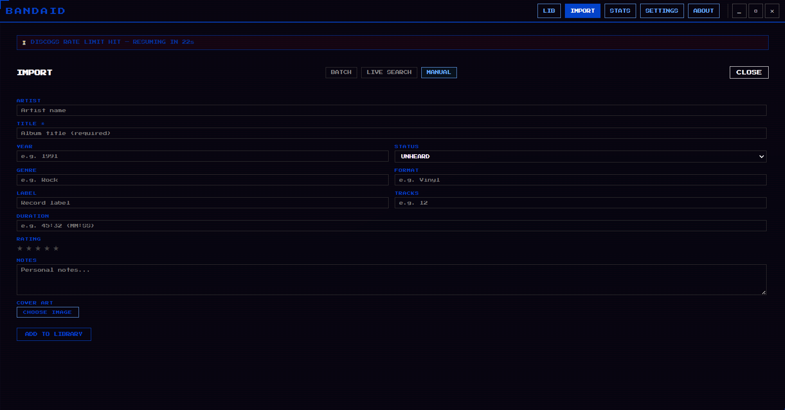

No Discogs token needed. Fill in whatever fields you have and upload cover art from disk.

---

## Statistics

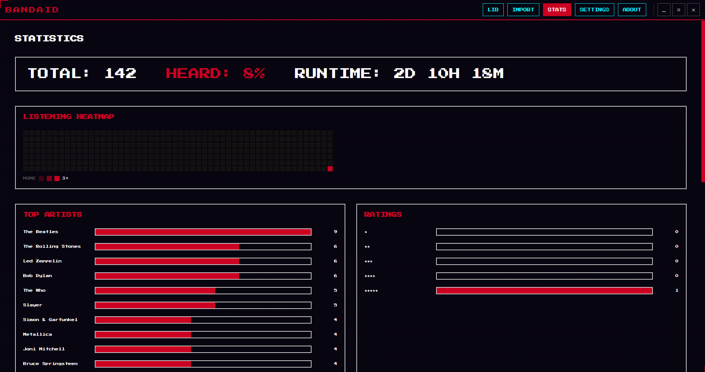

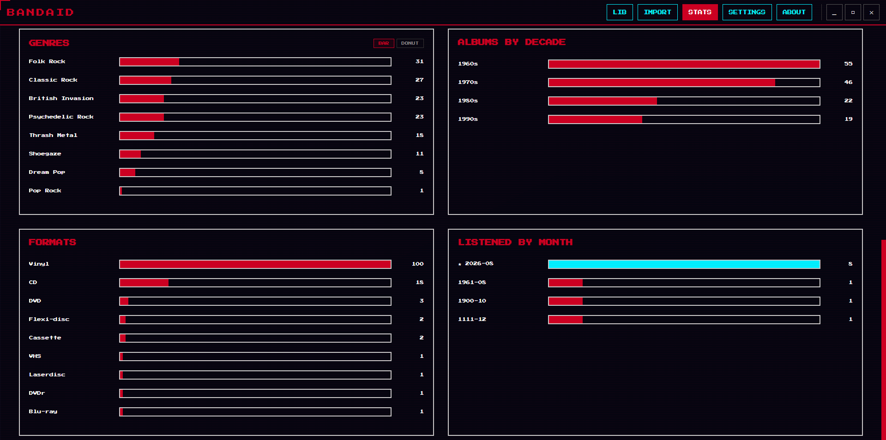

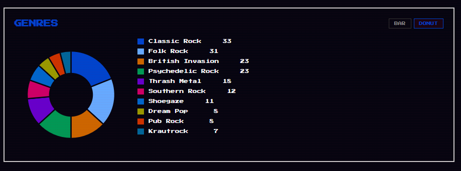

A full picture of your listening history:

- Total albums, percentage heard, total runtime
- 52-week listening heatmap
- Top artists by album count
- Rating distribution
- Genre breakdown — bar chart or donut chart
- Decade distribution
- Format breakdown
- Average rating per genre
- Monthly listening log

---

## Settings

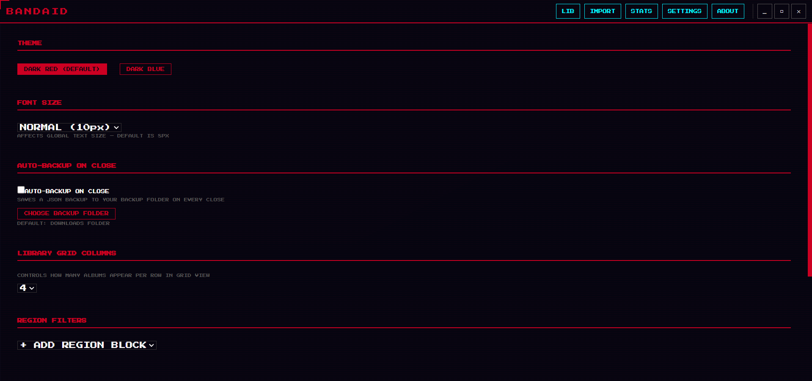

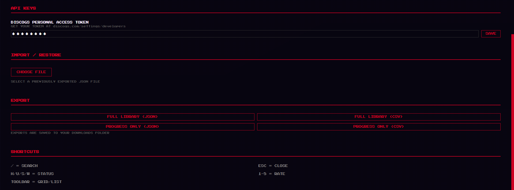

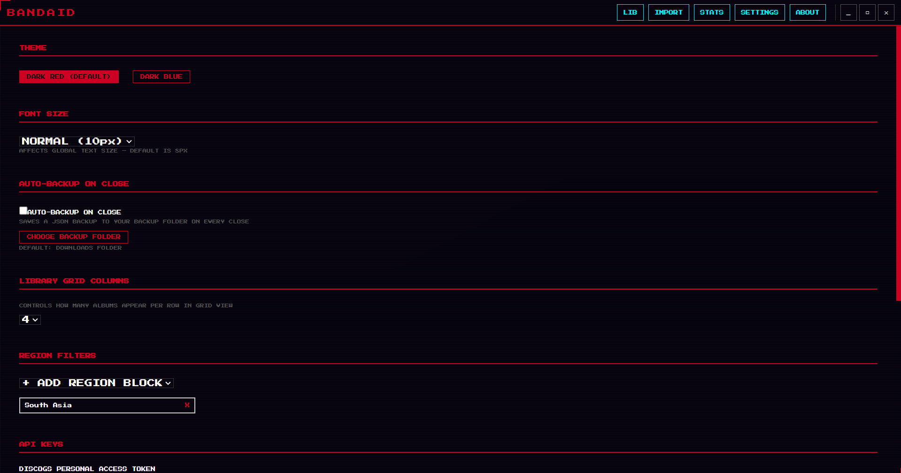

- **Theme** — red or blue
- **Font size** — adjustable base size
- **Data directory** — choose exactly where BandAid stores your database. All data follows.
- **Discogs token** — add or update your key
- **Region blocking** — define country codes to automatically filter out releases from those regions during import
- **Export** — full library as JSON or CSV; or a progress-only export (status, ratings, notes) that you can layer onto a fresh import later
- **Auto-backup** — writes a dated JSON snapshot on every close, to a directory of your choice

---

## Themes

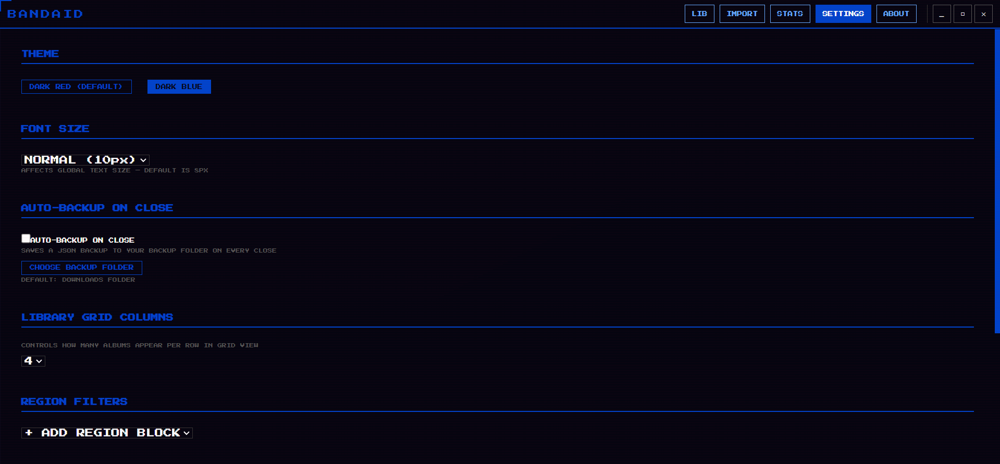

Red (default) or blue. Switch in Settings.

---

## About

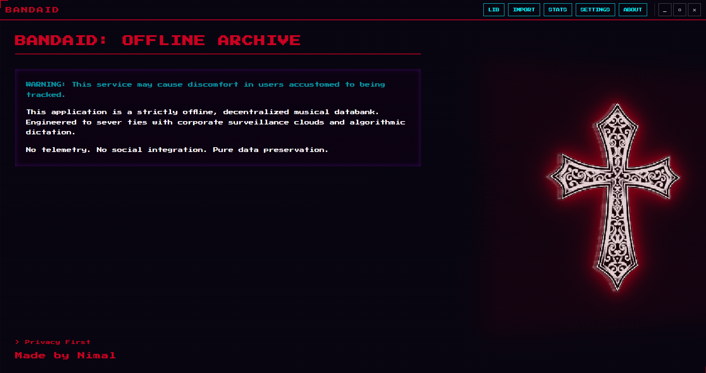

---

## Your Data

Everything lives locally at:

```
C:\Users\<you>\AppData\Roaming\BandAid\
```

Or wherever you point it in Settings. The only time BandAid touches the internet is when you trigger an import — it calls `api.discogs.com` to fetch metadata. No analytics, no crash reporting, nothing running in the background.

---

## Building from Source

```bash
git clone https://github.com/Nirmal2OO8/BandAid.git
cd BandAid
npm install
npm run package
```

Output goes to `dist-electron/`.

---

## Known Issues

- macOS and Linux builds don't exist yet
- No offline fallback if Discogs is unreachable mid-import
- Manually uploaded cover art is stored as base64 in the database, which grows large with heavy use

---

*Made by Nirmal*
